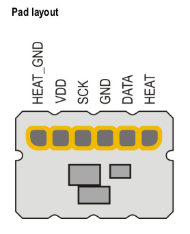

# Measuring Air Flow and Volume with Sensirion i2c SFM3300 - examples for Arduino (C, C++)

Arduino sketches in this project show application of Sensirion SFM3000 Series Mass Flow Meters for measuring the air flow and air volume.

## The race for ventilators
Current coronavirus outbreak may lead to a dire shortage of many medical supplies quickly. Mechanical lung ventilators are in high demand already as of the end of March 2020. There are several teams of enthusiasts and volunteers across the Globe who are trying to create mechanical ventilators of different levels of sophistication. In an attempt to help to the "AquaLung" ventilator project one SFM3300 was purchased (while it was still widely available at distributors). The "AquaLung" project will most probably be using different sensors in an attempt to not drain the supply chain and not interfere with professional medical equipment manufacturers.
Still, if this little code may help some other team out there to advance quicker and save lives - that was totally worth doing it!

## What you'll find here
The code was written with the following goals in mind:
* Show how simple it is to communicate with the sensor via i2c
* Provide easy to use snippets inside the working code
  * CRC calculation
  * Air Volume calculation
  * "Soft Timer Interrupts" technique with 1ms resolution
* Validate precision of Air Volume measurements achievable with SFM3300
  * Preliminary results appear to be very good (sub-cc resolution, good repeatability)
  * Volume measurements with repeatable precision - *work in progress*
  * Once validated - this project can be used for **testing other Air Flow and Volume sensors**

The code (or at least the snippets) is very compact and well commented. It can be adapted easily to any other C/C++ programming environment, or serve as examples for implementations in other programming languages. Each subsequent sketch builds upon previous one while adding a little bit of sophistication:

Sketch | Description
------ | -----------
<a href="https://github.com/MyElectrons/sfm3300-arduino/blob/master/examples/SFM3300_simplest/SFM3300_simplest.ino">SFM3300_simplest</a> | Run your SFM3300 with Arduino with just **10 lines of code** (not counting the usual Arduino initialization stuff)
<a href="https://github.com/MyElectrons/sfm3300-arduino/blob/master/examples/SFM3300_Original_CRC/SFM3300_Original_CRC.ino">SFM3300_Original_CRC</a> | Implement **CRC check according to manufacturer's documentation**
<a href="https://github.com/MyElectrons/sfm3300-arduino/blob/master/examples/SFM3300_CRC/SFM3300_CRC.ino">SFM3300_CRC</a> | **Nimble CRC** function; **Soft Reset** sensor at startup; Rough **Air Volume** calculation (integrating flow at 100ms intervals); **Soft Interrupt** example
<a href="https://github.com/MyElectrons/sfm3300-arduino/blob/master/examples/SFM3300_Flow_Volume_selfT/SFM3300_Flow_Volume_selfT.ino">SFM3300_Flow_Volume_selfT</a> | Read **Serial Number** at startup; **Improved Air Volume measurement precision** by taking measurements every 10ms; Reset Air Volume with every flow direction change for convenience

### Wish List

* Implement a non-blocking i2c interface and timing using hardware interrupts
* Reduce measurement intervals to the minimal supported by the sensor (4ms) to obtain the highest achievable precision
* Port it to a robust microcontroller

Obviously the code asks for being wrapped into a library with an easy to use interface. I will definitely do that as soon as there's a real-life use-case for this. **Please drop me a note should you have a need for this!**

## Connecting to the sensor

While the sensor manufacturer may provide specialized connection caps for the sensors, in this one-off project simple pogo-pins and a 0.1" (2.54mm) breadboard PCB were used to mock-up a detachable connector. This could have been a single board connector if I had short pogo-pins at hand.

The sensor heater was not used for this project, hence only four pins. Additional two pins can still be added.

The connector is held on top of the sensor with a zip-tie.

## Compatibility
The sensor requires 5V power supply and 5V-compatible levels and pull-ups on the i2c bus. As is it will work fine with any AVR based 5V Arduino board. The 5V i2c can be adapted to lower voltage controllers (e.g.: 3.3V - RPi, Arduino Due, ESP-8266, etc.) using a simple level converter with two low power MOSFET transistors, or an integrated i2c level converter or isolator.

The project was tested with 5V "Arduino NANO".

## How to Run

`git clone https://github.com/MyElectrons/sfm3300-arduino.git`

Run Arduino environment, load a sample sketch, compile and upload it

Open Serial Monitor: `Arduino --> Tools --> Serial Monitor`, set it to 115200 baud
